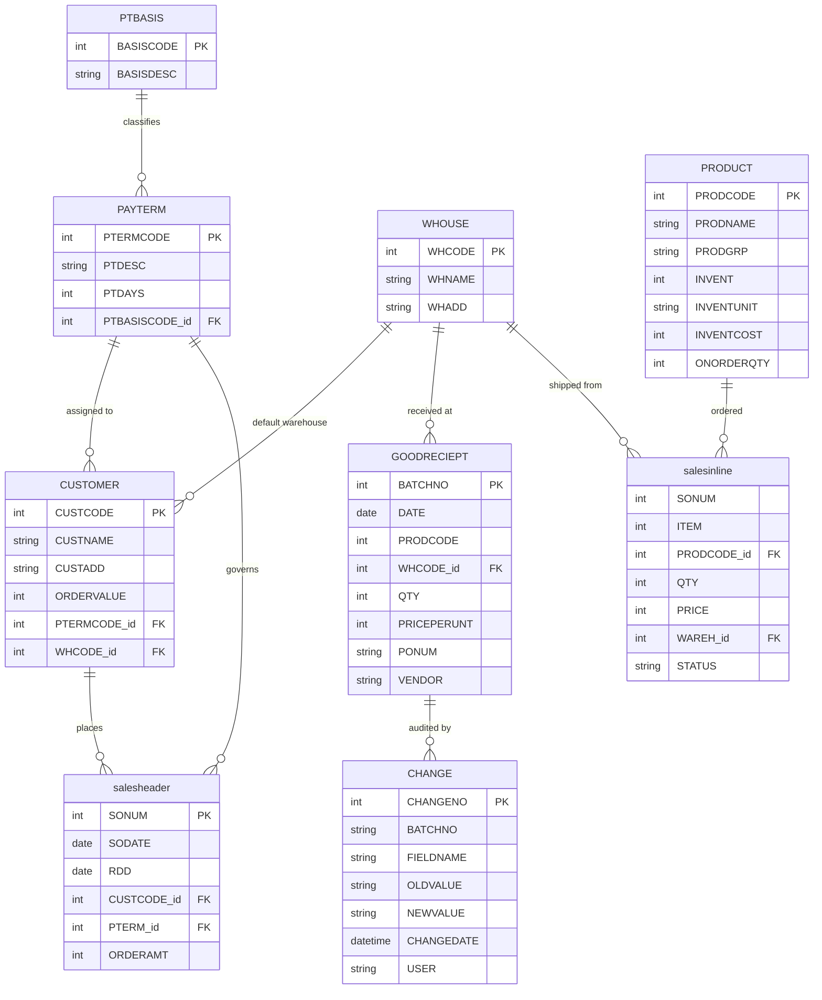
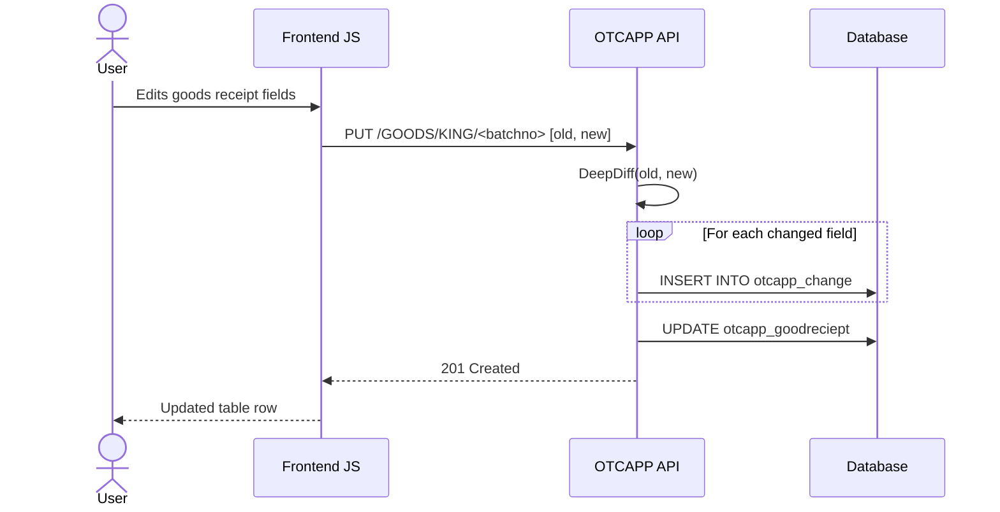

# OTC_Python

A **Django REST Framework** web application implementing an **Order-to-Cash (OTC)** business process. It covers the full cycle from warehouse and inventory management through customer orders and payment terms, backed by a REST API with a plain HTML/JavaScript frontend.

---

## Table of Contents

- [Overview](#overview)
- [Tech Stack](#tech-stack)
<!-- - [Architecture](#architecture)
- [Data Model](#data-model) -->
- [API Reference](#api-reference)
- [Frontend Pages](#frontend-pages)
- [Order-to-Cash Flow](#order-to-cash-flow)
- [Local Setup](#local-setup)
- [Project Structure](#project-structure)

---

## Overview

The OTC cycle implemented here covers:

| Domain | Functionality |
|---|---|
| **Warehousing** | Create, view, edit, and delete warehouse locations |
| **Payment Terms** | Define payment basis types and payment term rules |
| **Customers** | Register customers with assigned warehouses and payment terms |
| **Products** | Manage product catalogue with inventory and cost details |
| **Goods Receipt** | Record incoming stock with full audit trail of changes |
| **Sales Orders** | Create sales order headers and line items, update order values |

---

## Tech Stack

| Layer | Technology |
|---|---|
| Backend Framework | Django 6.x |
| REST API | Django REST Framework |
| Database | SQLite (local dev) / MySQL (production) |
| CORS | django-cors-headers |
| Change Tracking | deepdiff |
| Frontend | Vanilla HTML + JavaScript (Fetch API) |
| Styling | Custom CSS |

---

<!-- ## Data Model



--- -->

## API Reference

All API endpoints are served under the `OTCAPP` app. The frontend communicates with these via `fetch()`.

### Warehouses

| Method | URL | Description |
|---|---|---|
| `POST` | `/WHMAK/MAKE` | Create a warehouse |
| `GET` | `/WHSHO/SHOW` | List all warehouses |
| `GET` | `/WHSHO/SHOW/<pk>` | Get a specific warehouse |
| `DELETE` | `/WHDEL/DEL` | Delete a warehouse |
| `PUT` | `/WHUPDATE/UPDATE/<pk>` | Update a warehouse |
| `GET` | `/WHSHOWSPEC/WHSHOWSPECIFIC` | List warehouse codes only |

### Payment Terms

| Method | URL | Description |
|---|---|---|
| `POST` | `/PTC/C` | Create a payment term |
| `GET` | `/PTC/DIS` | List all payment terms |
| `GET` | `/SKR/SPEC/<pk>` | Get a specific payment term |
| `GET` | `/PTBASIS/PTSHOW` | List all payment basis types |
| `PUT` | `/MATRESS/UPD/<pk>` | Update a payment term |

### Customers

| Method | URL | Description |
|---|---|---|
| `POST` | `/CUSTAD/AD` | Create a customer |
| `GET` | `/CUSTSPEC/CUST/<pk>` | Get customer order value |
| `PUT` | `/CUSTAIUP/AI/<pk>/<gk>` | Update customer order value |

### Products

| Method | URL | Description |
|---|---|---|
| `POST` | `/PRODBR/BR` | Create a product |
| `GET` | `/PRODSI/SI` | List all products |
| `PUT` | `/PRODUCT/AIUPDATE/<pk>/<gk>` | Update product on-order qty |

### Goods Receipts

| Method | URL | Description |
|---|---|---|
| `POST` | `/GOODSY/O` | Create a goods receipt |
| `GET` | `/RECIEPTDA/D` | List all goods receipts |
| `GET` | `/RECIEPTDA/CLOCKER/<pk>` | Get a specific goods receipt |
| `DELETE` | `/GOODBANISH/BANISH` | Delete a goods receipt |
| `PUT` | `/GOODS/KING/<pk>` | Update a goods receipt (with audit log) |
| `GET` | `/htm/ht` | List all change log entries |

### Sales Orders

| Method | URL | Description |
|---|---|---|
| `POST` | `/CASH/MONEY` | Create a sales order header |
| `POST` | `/CASH1/MONEY1` | Add a sales order line item |
| `GET` | `/SALESSHOW/SALESBABY` | List all sales orders |
| `GET` | `/SALESSHOW/SALESSPECIFYINGLY/<pk>` | Get a specific sales order header |
| `GET` | `/SALESREP/NAHFAM/<pk>` | Get line items for a sales order |
| `PUT` | `/SALESREP/BEATSLAPPING/<pk>/<gk>` | Update sales order amount |
| `PUT` | `/SALESREP/DOUBLETROUBLE/<pk>/<gk>/<hk>/<sk>/<jk>/<lk>` | Update a sales line item |

---

## Frontend Pages

| URL | Page | Description |
|---|---|---|
| `/masterfile/` | Master Navigation | Links to all sections |
| `/WHMAKE/` | Warehouse Create | Form to add a warehouse |
| `/WHSHOW/` | Warehouse List | Table with edit/delete per row |
| `/WHEDIT/` | Warehouse Edit | Edit form for a warehouse |
| `/PTCREATE/` | Payment Term Create | Form to add a payment term |
| `/PTDISP/` | Payment Term List | Table of all payment terms |
| `/CUSTADD/` | Customer Create | Form to register a customer |
| `/PRODBRO/` | Product Create | Form to add a product |
| `/PRODSIS/` | Product List | Table of all products |
| `/GOODSYO/` | Goods Receipt Create | Form to record incoming stock |
| `/RECIEPTDAD/` | Goods Receipt List | Table with editing and audit trail |
| `/CASHMONEY/` | Sales Order Create | Multi-line sales order entry form |
| `/SALESHEADERSHOW/` | Sales Order List | Table of all sales orders |
| `/html/` | Change Log | Audit trail of goods receipt changes |

---

## Order-to-Cash Flow

```mermaid
flowchart LR
    A([Start]) --> B[Create Warehouse]
    B --> C[Define Payment Basis]
    C --> D[Define Payment Terms]
    D --> E[Register Customer\nassign PT + Warehouse]
    E --> F[Add Products\nto Catalogue]
    F --> G[Receive Goods\nGoods Receipt]
    G --> H[Create Sales Order\nHeader]
    H --> I[Add Line Items\nProduct + Qty + Price + Warehouse]
    I --> J[Order Amount\nUpdated on Customer]
    J --> K([End])

    style A fill:#4caf50,color:#fff
    style K fill:#f44336,color:#fff
```



### Goods Receipt Audit Trail

When a goods receipt record is updated, the system uses `deepdiff` to detect changed fields and writes each change to the `CHANGE` table automatically.



---

## Local Setup

### Prerequisites

- Python 3.10+
- Git

### Steps

```bash
# 1. Clone the repository
git clone <repo-url>
cd OTC_Python

# 2. Create and activate a virtual environment
python -m venv .venv
.venv\Scripts\activate        # Windows
source .venv/bin/activate     # macOS/Linux

# 3. Install dependencies
pip install django djangorestframework django-cors-headers deepdiff

# 4. Apply database migrations
python manage.py migrate

# 5. (Optional) Create an admin user
python manage.py createsuperuser

# 6. Run the development server
python manage.py runserver
```

Open **http://127.0.0.1:8000/masterfile/** in your browser.

### Switching to MySQL

In [OTC/settings.py](OTC/settings.py), replace the `DATABASES` block:

```python
DATABASES = {
    'default': {
        'ENGINE': 'django.db.backends.mysql',
        'NAME': 'otc',
        'USER': 'root',
        'PASSWORD': 'your_password',
        'HOST': '127.0.0.1',
        'PORT': 3306,
    }
}
```

Then install the MySQL driver: `pip install mysqlclient`

---

## Project Structure

```
OTC_Python/
├── manage.py
├── db.sqlite3                  # SQLite database (auto-created)
│
├── OTC/                        # Django project config
│   ├── settings.py             # App settings, DB config, installed apps
│   ├── urls.py                 # Root URL router
│   └── wsgi.py
│
├── OTCAPP/                     # REST API application
│   ├── models.py               # All data models (9 models)
│   ├── serializers.py          # DRF serializers for each model
│   ├── views.py                # All REST API view functions
│   └── urls.py                 # API URL patterns (re_path based)
│
├── Frontend/                   # Template-serving application
│   └── views.py                # Simple views that render HTML templates
│
├── templates/
│   └── Frontend/               # HTML templates (14 pages)
│       ├── masterfile.html     # Navigation hub
│       ├── make_warehouse.html
│       ├── show_warehouse.html
│       ├── make_pterm.html
│       ├── show_payments.html
│       ├── make_cust.html
│       ├── make_prod.html
│       ├── prod_show.html
│       ├── good_add.html
│       ├── goodshow.html
│       ├── sales.html          # Sales order entry
│       ├── showsales.html
│       └── ...
│
└── static/
    ├── css/                    # Per-page stylesheets
    └── javascript/             # Per-page JS (Fetch API calls)
```
